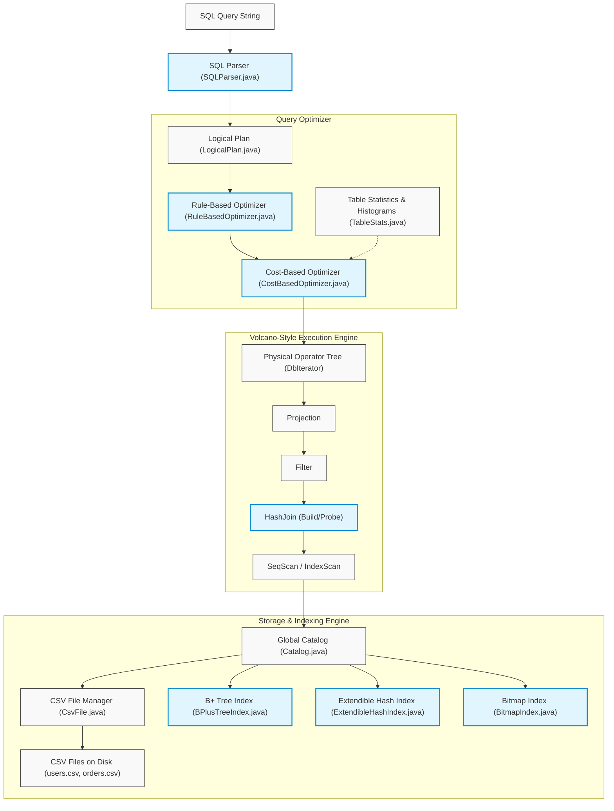

# Mini Database System

A high-performance, single-user relational database management system (RDBMS) implemented in Java from scratch, modeled after Berkeley CS186 and CMU 15-445 course architectures. 

It features a custom Volcano-style query execution engine, three distinct index implementations (B+ Tree, Extendible Hashing, and Bitmap), a cost-based query optimizer using column histograms, and an interactive SQL parser/console.

---

## 🏛 System Architecture

The following diagram illustrates how a SQL query flows through the database system, from parsing to execution, and how the Volcano operators interact with the storage and index engines:



---

## 🚀 Key Features & Components

### 1. Storage & Caching Layer
* **CSV File Manager (`CsvFile.java`):** Parses raw text records, maps them to database fields (`IntField`, `StringField`), and populates `Tuple` structures matching the schema (`TupleDesc`).
* **In-Memory Caching:** Implements lazy loading of parsed records in `CsvFile` to eliminate redundant disk seek and parser overhead during bookmark lookups.
* **Global Catalog (`Catalog.java`):** Maintains the mapping of table schemas, physical data file handles, and active index assignments.

### 2. Custom Indexing Structures
* **B+ Tree Index (`BPlusTreeIndex.java`):** A fully functional tree-based index. Supports search, insertion with leaf/internal node splitting, sibling chaining, and **node underflow borrowing (redistribution) and merging** on deletions.
* **Extendible Hash Index (`ExtendibleHashIndex.java`):** An in-memory hash index that doubles directory slots dynamically when global depth equals local depth, routing point queries in $O(1)$ time.
* **Bitmap Index (`BitmapIndex.java`):** A highly compressed index for low-cardinality values utilizing Java's `BitSet` to perform extremely fast bitwise intersection/union filters.

### 3. Volcano Execution Engine (`DbIterator`)
An iterator-based relational query processor executing row-by-row pipelining:
* `SeqScan` / `IndexScan`: Scans CSV rows or queries indexes to yield matching record IDs.
* `Filter`: Evaluates boolean predicates (`=`, `>`, `<`, etc.).
* `Projection`: Discards unused columns to save memory.
* `HashJoin`: Evaluates inner joins using an in-memory build-probe hash table.

### 4. Hybrid Query Optimizer
* **Rule-Based Optimizer (RBO):** Pushes selections and projections down through join operators to execute filters as close to the disk/scan level as possible.
* **Cost-Based Optimizer (CBO):**
  * Tracks column statistics (`TableStats.java`) and computes table size estimations using column histograms (`IntHistogram`, `StringHistogram`).
  * Optimizes multi-way joins using a greedy search algorithm to construct left-deep join trees, setting the smaller relation as the build (left) side of the join.
  * Estimates index scan costs to dynamically swap `SeqScan` with `IndexScan` when selectivity is high.

---

## 📈 Quantitative Performance Benchmarks


Benchmarks were executed on a dataset containing **100,000 users** (`users.csv`) and **300,716 orders** (`orders.csv`).

### Point Query Lookup
*Query: `SELECT name, age FROM users WHERE id = 50000`*
* **SeqScan + Filter:** `5.063 ms`
* **B+ Tree IndexScan:** `0.221 ms`
* **Performance Gain:** **22.9x faster** (95.6% latency reduction)

### Index Range Scan
*Query: `SELECT name, age FROM users WHERE age = 30` (returns 2,059 rows)*
* **SeqScan + Filter:** `5.562 ms`
* **B+ Tree IndexScan:** `0.743 ms`
* **Performance Gain:** **7.5x faster** (86.6% latency reduction)

### End-to-End Join Query Optimization
*Query: `SELECT u.name, o.item FROM users u JOIN orders o ON u.id = o.user_id WHERE u.age = 30`*
1. **Baseline Plan** *(No index, naive join order, no filter pushdown)*: `96.369 ms`
2. **Rule-Based Plan** *(No index, pushdown + build users)*: `27.334 ms` (**3.5x faster**)
3. **Cost-Based Plan** *(B+ Tree index + pushdown + build users)*: `18.884 ms` (**5.1x faster than Baseline**, **1.4x faster than Rule-Based**)

---

## 🛠 How to Build and Run

All tasks are packaged in the `build.ps1` PowerShell script.

### 1. Generate Mock Benchmark Data
Generate the dataset of 100k users and ~300k orders:
```powershell
powershell -ExecutionPolicy Bypass -File ./build.ps1 -generate 100000
```

### 2. Run the Verification Tests
Execute the unit and integration test suite (covering B+ Tree, Hash, Volcano, and Optimizer):
```powershell
powershell -ExecutionPolicy Bypass -File ./build.ps1 -test
```

### 3. Run the Benchmarks
Measure the exact milliseconds and speedup multipliers on your hardware:
```powershell
powershell -ExecutionPolicy Bypass -File ./build.ps1 -benchmark
```

### 4. Launch the Interactive Shell Console


Open a SQL shell to execute queries and explain plans interactively:
```powershell
powershell -ExecutionPolicy Bypass -File ./build.ps1 -console
```
*Try typing these queries inside the console:*
```sql
minidb> SELECT u.name, u.age FROM users u WHERE u.id = 50000
minidb> explain SELECT u.name, o.item FROM users u JOIN orders o ON u.id = o.user_id WHERE u.age = 30
```
